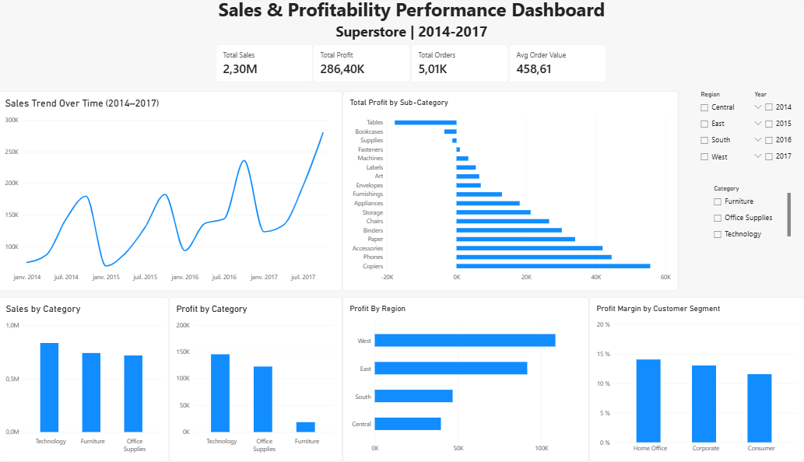

# Sales Analysis

## Project Overview

This project analyzes a retail sales dataset to uncover trends in sales and profitability, identify high-performing product categories, and understand how different business factors affect overall performance.

The analysis was performed using **Python** for data cleaning and exploratory data analysis (EDA), and **Power BI** for interactive data visualization and dashboard development.

---

## Power BI Dashboard

---

## Objectives

The main objectives of this project are to:

* Analyze overall sales and profit performance
* Identify sales and profit trends over time
* Compare product categories and sub-categories
* Analyze regional and customer-segment performance
* Examine the relationship between discounts, sales, and profit
* Identify key business insights that could support decision-making
* Present the findings through an interactive Power BI dashboard

---

## Dataset

The dataset contains **9,994 rows and 21 columns** covering retail orders.

Key variables include:

* Order Date
* Ship Date
* Ship Mode
* Customer
* Segment
* Country
* City
* State
* Region
* Category
* Sub-Category
* Product Name
* Sales
* Quantity
* Discount
* Profit

---

## Tools & Technologies

* **Python**

  * Pandas
  * Matplotlib
* **Jupyter Notebook**
* **Power BI**
* **GitHub**

---

## Analysis Process

### 1. Data Preparation

The dataset was inspected and prepared for analysis, including:

* Checking data types
* Converting date columns to datetime format
* Checking for missing values
* Checking for duplicate records
* Examining numerical and categorical variables

### 2. Exploratory Data Analysis

The analysis explored:

* Sales and profit distributions
* Sales trends over time
* Category and sub-category performance
* Regional performance
* Customer segments
* Quantity and discount patterns
* Relationships between sales, discounts, and profit

### 3. Data Visualization

Visualizations were created to make important patterns easier to identify.

### 4. Power BI Dashboard

An interactive Power BI dashboard was created to present the main KPIs, trends, comparisons, and business insights from the analysis.

---

## Key Findings

Some of the main findings from the analysis include:

* **Total Sales:** $2,297,200.86
* **Total Profit:** $286,397.02
* Sales showed an overall **upward trend from 2014 to 2017**.
* Sales generally peaked toward the **end of the year**, while January tended to have the lowest sales.
* **Technology** generated the highest sales and profit among the three main categories.
* **Furniture** generated more sales than Office Supplies but produced less profit.
* Discounts and profitability showed an important relationship that can be explored further at the product and category level.

---

## Project Files

 'sales_analysis.ipynb' Python notebook containing data preparation, exploratory analysis, visualizations, and findings 
 'Sales_Analysis.pbix'  Power BI file containing the interactive dashboard                                              

---

## Business Insights

The analysis can help a retail business understand:

* Which products and categories generate the most value
* Which periods produce the strongest sales
* Where profitability can be improved
* How discounts may affect profit
* Which customer segments and regions perform best

These insights can support better decisions around **product strategy, pricing, discounts, and sales planning**.

---

## Author

**Jouri**

Data Analyst Portfolio Project
